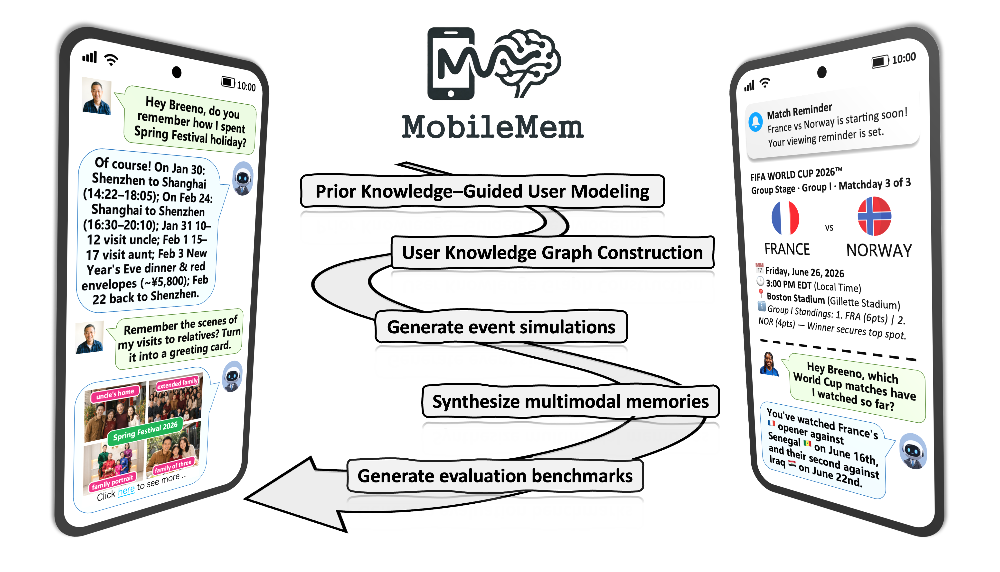
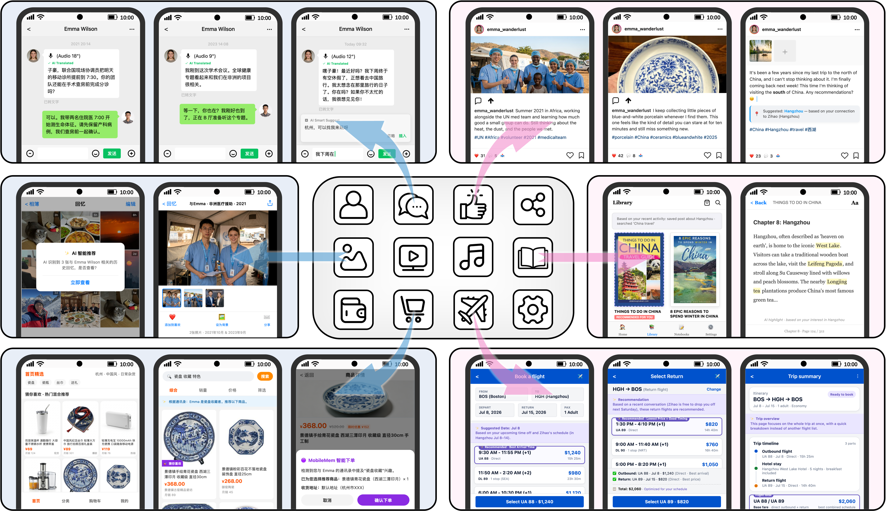

<div align="center">


### MobileMem: Learning from a Year of Mobile Experiences

[](https://arxiv.org/abs/2608.13606)
[](https://zjunlp.github.io/MobileMem/)
[](https://huggingface.co/datasets/zjunlp/MobileMem)
[](#license)

---



**MobileMem** is a comprehensive benchmarking framework for evaluating **on-device memory systems** in realistic mobile environments.


</div>

---

## 📑 Table of Contents

- [🔥 News](#-news)
- [🎯 Applications](#-applications)
- [📊 Dataset Structure](#-dataset-structure)
- [🚀 Getting Started](#-getting-started)
  - [📖 Text Track](#-text-track)
  - [🖼️ Omni Track](#️-omni-track)
- [🗂️ Project Structure](#️-project-structure)
- [🔍 Analyzing Failures with MemTrace](#-analyzing-failures-with-memtrace)
- [🚩 Citation](#-citation)

---

## 🔥 News
- **2026-08-01** — We publicly release the MobileMem dataset.
- **2026-05-16** — We launch the English version of the dataset and benchmark.
- **2026-05-03** — We launch the Chinese version of the dataset and benchmark.


---

## 🎯 Applications

MobileMem is built from **multiple heterogeneous sources** to enable comprehensive on-device memory modeling.



---

## 📊 Dataset Structure

MobileMem contains two complementary splits:

| Split | Modality | Description |
| :--- | :--- | :--- |
| **text** | Text | Long-horizon user–assistant conversations and structured mobile-app events for evaluating textual memory systems. |
| **omni** | Text and images | Multimodal mobile interactions with screenshots and photos. |

The dataset is available for download at [HuggingFace](https://huggingface.co/datasets/zjunlp/MobileMem).

---

## 🚀 Getting Started

MobileMem offers two benchmark tracks. Choose the path that fits your needs and navigate to the corresponding resources.

For an interactive visualization of the MobileMem data, visit the [Dataset Explorer](https://github.com/zjunlp/MobileMem/tree/Dataset-Explorer) branch.

### 📖 Text Track
The textual benchmark for evaluating memory systems on long-term, knowledge-intensive mobile agent trajectories.

| Section | Description | Quick Link |
| :--- | :--- | :--- |
| **📥 Data Access** | Download the synthesized KEME trajectories and QA pairs from HuggingFace. | [Link](https://huggingface.co/datasets/zjunlp/MobileMem) |
| **⚙️ How to Evaluate** | **Detailed evaluation guide for reproducing leaderboard results is available in the [MemBase](https://github.com/zjunlp/MemBase/tree/main/examples/evaluate_memory_systems_on_mobilemem) repository.** | [Link](https://github.com/zjunlp/MemBase/tree/main/examples/evaluate_memory_systems_on_mobilemem) |
| **🛠️ Data Construction** | Reproduce the KEME synthesis pipeline from scratch. | [Link](https://github.com/zjunlp/MobileMem/tree/main/text) |

### 🖼️ Omni Track
The multimodal benchmark for evaluating on-device memory with realistic mobile images and dialogues.

| Section | Description | Quick Link |
| :--- | :--- | :--- |
| **📥 Data Access** | Download the MobileMem-Omni dataset, including images and dialogues. | [Link](https://huggingface.co/datasets/zjunlp/MobileMem) |
| **⚙️ How to Evaluate** | **Detailed evaluation guide for reproducing leaderboard results is available in the [MemBase](https://github.com/zjunlp/MemBase/tree/main/examples/evaluate_memory_systems_on_mobilemem_omni) repository.** | [Link](https://github.com/zjunlp/MemBase/tree/main/examples/evaluate_memory_systems_on_mobilemem_omni) |
| **🛠️ Data Construction** | Rebuild the entire MobileMem-Omni dataset with the provided pipeline. | [Link](https://github.com/zjunlp/MobileMem/tree/main/omni) |

---

## 🗂️ Project Structure

The repository is organized into two main tracks, each containing everything you need for data access, evaluation, and construction.

```bash
MobileMem/
├── text/                           # 📖 Text Track
│   ├── README.md                   # Track-specific guide and dataset download
│   ├── keme/                       # 🛠️ KEME synthesis pipeline code
│   └── eval/                       # ⚙️ Evaluation scripts for text track
├── omni/                           # 🖼️ Omni Track
│   ├── README.md                   # Track-specific guide and dataset download
│   ├── src/                        # 🛠️ Data construction pipeline code
│   ├── eval/                       # ⚙️ Evaluation scripts for omni track
└── README.md                       # This file
```

---

## 🔍 Analyzing Failures with MemTrace
We recommend using **[MemTrace](https://github.com/zjunlp/MemTrace)** to perform an in-depth error analysis. MemTrace helps you visualize and diagnose where and why your memory system fails, making it easier to pinpoint areas for improvement. For an example of how to use MemTrace, please refer to the [tutorial](https://github.com/zjunlp/MemBase/tree/main/examples/trace_memory_lifecycle_with_membase) in MemBase.

---

## 🚩 Citation

If this work or datasets is helpful, please kindly cite as this:

```bibtex
@misc{deng2026mobilememlearningyearmobile,
      title={MobileMem: Learning from a Year of Mobile Experiences}, 
      author={Xinle Deng and Yida Xue and Xiangyuan Ru and Haoming Xu and Shuofei Qiao and Mengru Wang and Yijun Chen and Buqiang Xu and Chen Jiang and Yuchen Eleanor Jiang and Lizhong Wang and Jianfeng Wang and Li Zeng and Haofen Wang and Guilin Qi and Huajun Chen and Ningyu Zhang},
      year={2026},
      eprint={2608.13606},
      archivePrefix={arXiv},
      primaryClass={cs.AI},
      url={https://arxiv.org/abs/2608.13606}, 
}
```
