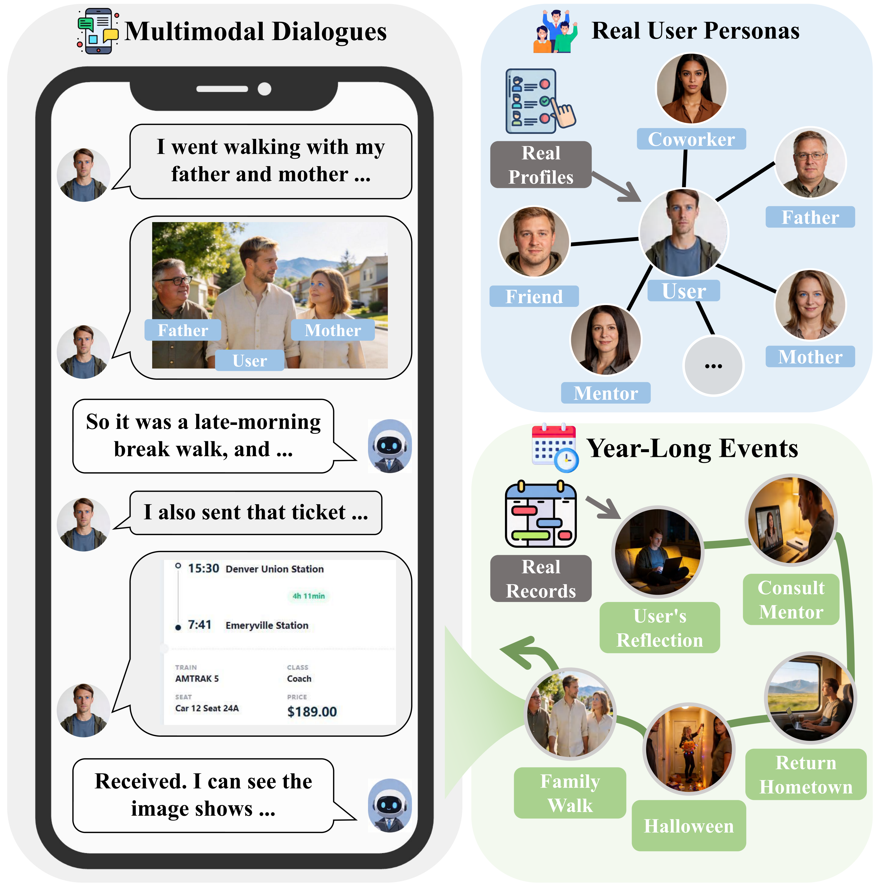
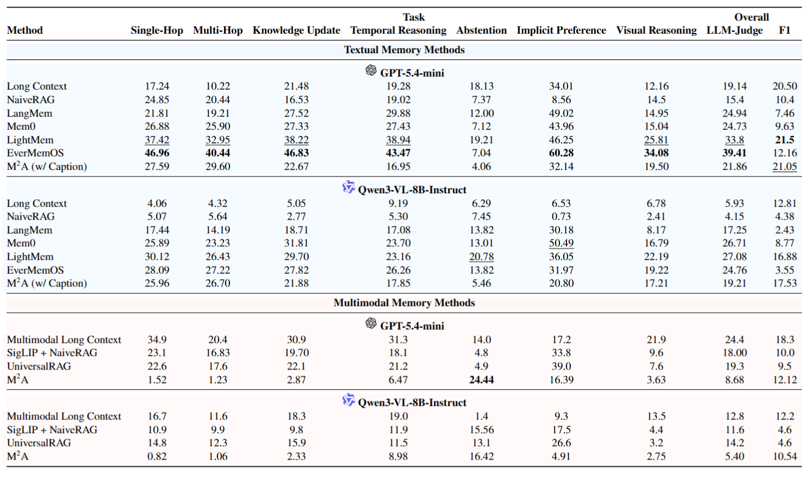
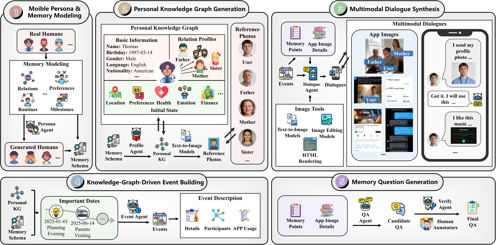

## 📑 Table of Contents

- [📚 Datasets](#-datasets)
  - [📥 Dataset Access](#-dataset-access)
  - [📊 Benchmark Statistics](#-benchmark-statistics)
  - [🖼️ Image Types](#️-image-types)
  - [🧠 Memory Tasks](#-memory-tasks)
  - [🧱 Benchmark Structure](#-benchmark-structure)
- [🏆 Leaderboard](#-leaderboard)
- [🚀 Quick Start](#-quick-start)
  - [📦 Environment Setup](#-environment-setup)
  - [📥 Dataset Download](#-dataset-download)
  - [⚙️ Evaluation](#evaluation)
  - [🖼️ Data Construction](#️-data-construction)
- [🌻 Acknowledgement](#-acknowledgement)

---

## 🌟 Overview
MobileMem-Omni provides multimodal dialogues for mobile scenarios grounded in real user information and year-long event trajectories.




| Feature | Description |
|:--------|:------------|
| 🧑 **Real User Personas** | 8 recruited participants + 8 LLM-generated virtual personas |
| 🌏 **Multilingual Dialogues** | Role-based English and Chinese interactions |
| 🖼️ **Personalized Mobile Images** | 19,060 images across 12 categories |
| 🧠 **7 Memory Task Types** | From single-hop retrieval to visual reasoning |

---

## 📚 Datasets
### 📥 Dataset Access
The MobileMem dataset is now publicly available on 🤗 Hugging Face at [`zjunlp/MobileMem-Omni`](https://huggingface.co/datasets/zjunlp/MobileMem-Omni).

### 📊 Benchmark Statistics
| Category | Metric | Value |
|:---------|:-------|------:|
| **👤 Users** | Total / English / Chinese | **16** / 8 / 8 |
| **📅 Events** | Total Events | **1,589** |
| **💬 Dialogues** | Total Turns / Avg Turns per Session | **155,670** / 48.2 |
| **🖼️ Images** | Total Images / Avg Images per Session | **19,060** / 5.88 |
| **📝 Context** | Avg Context Length (tokens/user) | **1.72M** |
| **❓ Questions** | Total / Single / Multi / Update / Temporal / Implicit / Abstention / Visual | **7,415** / 986 / 1,135 / 1,010 / 773 / 1,226 / 1,208 / 1,077 |
---

### 🖼️ Image Types

MobileMem-Omni encompasses **12 image types** sourced from diverse mobile applications:

| Category | Description | Generation Method |
|:---------|:------------|:------------------|
| 📸 **Persona Reference Photos** | Persona appearances | Text-to-image models |
| 📸 **KG Reference Photos** | Knowledge graph person appearances | Text-to-image models |
| 📷 **Camera Photos** | Event scenes with persona and social contacts | Image editing models |
| 📚 **Book Screenshots** | E-book reading progress and metadata | HTML rendering |
| 🎵 **Music Screenshots** | Music streaming interfaces with song details | HTML rendering |
| 🎬 **Video Screenshots** | Video streaming with covers and stats | HTML rendering + text-to-image |
| 💳 **Transaction Records** | Payment interfaces with amounts and notes | HTML rendering |
| 🎫 **Ticket Records** | Booking confirmations with journey details | HTML rendering |
| 🛍️ **Shopping Records** | Order pages with product information | HTML rendering |
| 💬 **Social Chat Records** | Messaging app conversations | HTML rendering |
| 📱 **Social Media Posts** | Content sharing with likes and comments | HTML rendering |
| 🗺️ **Others** | Scenery, food, maps, weather, etc. | Text-to-image models |

---

### 🧠 Memory Tasks

MobileMem-Omni evaluates **7 types** of memory reasoning tasks:

| Task | Description | Example Question |
|:-----|:------------|:-----------------|
| **Single-Hop** | Retrieve a single factual piece | *"What is the user's occupation?"* |
| **Multi-Hop** | Synthesize information from multiple facts | *"Where did the user go for their anniversary trip, and with whom?"* |
| **Knowledge Update** | Incorporate new info, revise outdated memory | *"What is the user's current location after their recent move?"* |
| **Temporal Reasoning** | Capture and reason about time-related cues | *"When did the user first mention their upcoming exam?"* |
| **Implicit Preference** | Infer latent user attributes or preferences | *"What type of cuisine does the user prefer?"* |
| **Abstention** | Correctly decline to answer when info is absent | *"What did the user eat for breakfast two weeks ago?"* → *"I don't know"* |
| **Visual Reasoning** | Interpret and reason over visual content | *"Based on the screenshot, what is the total transaction amount?"* |

---

### 🧱 Benchmark Structure

#### Each persona's data is stored as a JSON:

| Field | Description |
|:------|:------------|
| `uuid` | Unique user identifier |
| `language` | Language of the persona data, currently either `Chinese` or `en` |
| `Basic_Profile` | Basic profile information of the persona |
| `Init_State` | Initial state of the persona, including education, location, occupation, preferences, and social relationships |
| `Important_Dates` | Important dates associated with the persona |
| `sessions` | List of multi-turn conversational sessions |
| `session_stats_summary` | Summary statistics across all sessions of the persona |
| `_errors` | List of data processing errors; empty if no errors occurred |

---

#### Each `session` contains:

| Field | Description |
|:------|:------------|
| `session_id` | Unique session identifier |
| `event_id` | Event identifier; independent events are usually integers, while sub-events are usually strings |
| `parent_event_id` | Parent event identifier; `null` for independent events |
| `event_name` | Name of the event |
| `event_start_time` | Start time of the event |
| `event_end_time` | End time of the event |
| `dialogue_goal` | Goal of the dialogue in this session |
| `dialogue_summary` | Summary of the dialogue in this session |
| `dialogue` | Sequence of utterances between the user and the assistant |
| `image_refs` | Categorized image references related to the session |
| `image_candidates` | List of all candidate image paths available for this session |
| `own_memory_points` | Memory points generated directly from this session |
| `shared_parent_memory_points` | Memory points shared from the parent event |
| `child_event_memories` | Memory points derived from child events; these are also included in `own_memory_points` |
| `memory_points` | Complete list of memory points available to the session, merged from `own_memory_points` and `shared_parent_memory_points` |
| `parent_memory_key` | Key used to associate the session with parent-event memories |
| `session_stats` | Statistics of the current session |

---

#### Dialogue Structure

Each utterance in `dialogue` contains:

| Field | Description |
|:------|:------------|
| `turn` | Turn index of the utterance |
| `role` | Speaker role, either `user` or `assistant` |
| `content_type` | Type of content, either `text` or `image` |
| `content` | Text content, used when `content_type` is `text` |
| `image_inline` | Image path, used when `content_type` is `image` |

---

#### Memory Point Structure

`own_memory_points`, `shared_parent_memory_points`, `child_event_memories`, and `memory_points` share the same memory point structure:

| Field | Description |
|:------|:------------|
| `memory_id` | Unique identifier of the memory point |
| `memory_source` | Source of the memory, one of `primary`, `secondary`, `interference`, or `system` |
| `memory_type` | Type of memory, currently including `Persona Memory`, `Event Memory`, `Preference Memory`, `Dialogue Memory`, and `Image Memory` |
| `memory_content` | Textual description of the memory content |
| `timestamp` | Time when the memory was created or when the corresponding event occurred |
| `importance` | Relative importance score ranging from 0 to 1 |
| `is_update` | Whether the memory updates or supersedes earlier information |
| `original_memories` | List of original memories related to the current memory point |
| `image_refs` | List of image paths that support the memory |
| `dialogue_turn_ids` | List of dialogue turn indices that support the memory |

---

#### Question Structure

Each question contains:

| Field | Description |
|:------|:------------|
| `question_id` | Unique question identifier |
| `question` | Question text; for multiple-choice questions, the options are also included in this string |
| `answer` | Ground-truth answer |
| `question_format` | Format of the question, either `multiple_choice` or `open_ended` |
| `question_type` | Type of the question |
| `difficulty` | Difficulty level of the question, one of `easy`, `medium`, or `hard`; this field is missing in a small number of records |
| `evidence` | List of evidence supporting the answer |
| `image_refs` | List of image paths involved in the question; this field is missing in a small number of records |
| `source_session_ids` | List of source session identifiers |
| `source_event_ids` | List of source event identifiers |

---

## 🏆 Leaderboard



---

## 🚀 Quick Start

### 📦 Environment Setup

#### Create and activate a dedicated conda environment:

```bash
conda create -n mobilemem python=3.11
conda activate mobilemem
```

#### Clone code

```bash
git clone https://github.com/zjunlp/MobileMem
cd MobileMem/omni
pip install -r requirements.txt
playwright install --with-deps chromium
```

`--with-deps` pulls the system libraries headless Chromium needs (`libnss3`,
`libatk`, …). It needs `sudo` on Debian/Ubuntu; drop the flag if those libraries
are already present or you cannot elevate.

Alternatively, `omni/scripts/run_trajectory_smoke.sh` uses Conda to create the
repository `.venv` and installs missing packages and Chromium only when needed.

#### Chinese screenshots need a CJK font

Screenshot templates ask for `PingFang SC` / `Microsoft YaHei`, which do not
exist on a bare Linux box. Without a CJK font installed, Chinese text renders as
tofu boxes (`□□□`) and the failure is silent. On Debian/Ubuntu:

```bash
sudo apt-get install -y fonts-noto-cjk
```

Verify with `fc-list :lang=zh | head`.

#### Optional face-swap weights

`inswapper_128.onnx` is not distributed via pip. Face swapping is skipped
cleanly when it is absent; set `INSWAPPER_MODEL` to its path to enable it. The
`buffalo_l` detector is downloaded by InsightFace on first use.

The 14-node construction DAG has no offline generation mode. Listing the DAG
and running tests are offline, while producing a new trajectory calls text and
image APIs.

---

### 📥 Dataset Download

#### Option 1: Using HuggingFace CLI

```bash
huggingface-cli download --repo-type dataset --resume-download zjunlp/MobileMem-Omni --local-dir OceanBenchmark
```

#### Option 2: Using Python

```python
from datasets import load_dataset

dst = load_dataset("zjunlp/MobileMem-Omni")
```
---

### <a id="evaluation"></a> ⚙️ Evaluation

We provide step-by-step evaluation procedures and scripts in the [`omni/eval`](https://github.com/zjunlp/MobileMem/tree/main/omni/eval) directory to run baseline memory systems.

---

### 🖼️ Data Construction


The dataset is produced by a declarative pipeline — a DAG of stages that turns a persona spec (or a CSV profile) into a full year of multimodal mobile memories.
Then, the pipeline progressively generates event trajectories, memory points, images, and dialogues in a structured, stage-by-stage manner.

#### Navigate to the directory

```powershell
cd src
cp .env.example .env          # then fill in your API keys
```

#### Run the pipeline

```powershell
# List all stages in topological order
python -m pipeline.cli list

# Run the whole pipeline for every persona
python -m pipeline.cli run

# Run a single stage, or a stage plus everything downstream
python -m pipeline.cli run --only event_photo
python -m pipeline.cli run --from social_world

# Restrict to specific persona uuid(s) and cap the events per persona
python -m pipeline.cli run --uuid 0 --max-events 15

# Set up missing local dependencies and run one small online trajectory
bash ../scripts/run_trajectory_smoke.sh

# Create corresponding dialogues and memory points.
python ../data/final_dataset/generate_code/stage5_sessions.py `
  --input-file ../output/data/annual_events.jsonl `
  --output-file ../output/debug/stage5_uuid0.jsonl `
  --image-dir ../output/image `
  --uuid-filter 0 `
  --max-workers 1 `
  --session-workers 2

# Generate seven categories of evaluation questions
python ../data/final_dataset/generate_code/stage6_questions.py `
  --input-file ../output/debug/stage5_uuid0.jsonl `
  --output-file ../output/debug/stage6_questions_uuid0.jsonl `
  --uuid-filter 0 `
  --question-types single_hop multi_hop temporal_reasoning `
  --target-per-type 200 `
  --resume-incomplete
```

---

#### Stages

Records are written to `output/data/` (JSONL); rendered media to `output/image/`.

| # | Stage (node) | Output |
|--:|:-------------|:-------|
| 1 | `profile` | `basic_profiles.jsonl` |
| 2 | `persona_seeds` | `basic_profiles.jsonl` (appends LLM-seeded personas) |
| 3 | `life_state` | `init_states.jsonl` |
| 4 | `social_name_fix` | rewrites `init_states.jsonl` |
| 5 | `timeline_dates` | `important_dates.jsonl` |
| 6 | `social_world` | `social_graph.jsonl` |
| 7 | `annual_events` | `annual_events.jsonl` |
| 8 | `sub_events` | `sub_events.jsonl` |
| 9 | `conversation` | `group_chats.jsonl` + chat images |
| 10 | `app_trace` | `app_screenshots.jsonl` + app images |
| 11 | `event_photo` | `event_images.jsonl` + event photos |
| 12 | `document` | `tickets.jsonl` + document images |
| 13 | `scenery` | scenery images |
| 14 | `memory_summary` | `image_summaries.jsonl` + `total_images.jsonl` |

> See `src/pipeline/README.md` for the full stage reference.

---

## 📋 Dataset Logs

The [MobileMem-Omni Logs](https://drive.google.com/file/d/1ZPaUzsu-gyDXZYqiy2b47v6grnfBg7HW/view?usp=drive_link) contain the experimental logs.

## 🌻 Acknowledgement

We thank the open-source community for their contributions. This work has benefited from the foundational efforts of [Mem-Gallery](https://github.com/YuanchenBei/Mem-Gallery) and [HaluMem](https://github.com/MemTensor/HaluMem).
